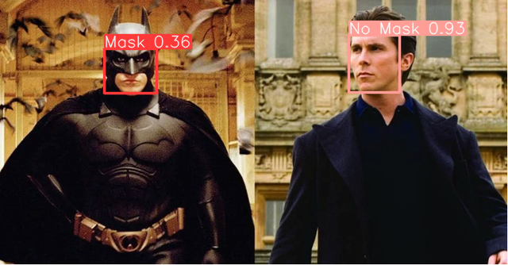

# are you wearing a mask?

State of the art model for detecting masked and unmasked faces. Try out the [demo](https://huggingface.co/spaces/hlydecker/are-you-wearing-a-mask)!




**Figure 1:** An example prediction from a model trained on version 5 of the face masks ensemble dataset. This model was able to produce entertaining predictions like that batman is wearing a mask, however this reveals that the model is perhaps learning the wrong thing. From this example we can see that the model thinks that if the top half of a face an the bottom half are different, there might be a mask. Additional data was added to the dataset, and augmentations were made to produce version 8, which was able to address these pitfalls.

## Introduction

### COVID-19 and face masks

Over six million people have died from infections with SARS coronavirus 19 (COVID-19) over the last two years, and over 521 million people have contracted this virus in what is the most devestating pandemic since the Spanish flu of the early 20th century. A critical component of responding to the lethal threat of this pandemic has been adopting transmission control behaviours, the most controversial of which has been wearing face masks. Face masks have for centuries been recognized as effective barriers for transmission of disease, even before the advent of modern germ theory. While there is some debate about the exact amoutn of protection provided by face masks, the evidence is clear that in areas where face masks use was widepread, cases and mortalities were reduced. 

A persistant issue throughout the COVID-19 pandemic has been modelling and estimating transmission of infections from person to person. COVID-19 cases are caused by infection with the SARS-CoV-2 virus, and like most other respiratory viruses in the Coronaviridae family, is spread through respiratory droplets that are released during choughing, sneezing, and speaking. Face masks reduce transmission of SARS-CoV-2 by acting as a filter for air entering and leaving a person's mouth: catching respiratory particals before then can either leave or enter the mask. The degree to which face masks can suppress infection varies depending on the quality of the mask, with some providing far more effective filtration. 

### Artificial Intelligence

Over the last decade there have been massive strides forward in developing and applying computer vision algorithms into the real world. This progress has been driven by revolutions in how to accelerate neural network compution through the use of graphics processing units. 

### Face Masks Datasets

To train a model to detect masked and unmasked faces, we will need a dataset with images and annotations. Model performance generally increases with the size, diversity, and quality of the dataset. A good starting point for dataset size is 3000 images per class. 

Ideally you shoul have a balanced number of images for each class. Models are built to try and find the simplest solution to a problem. If you train a model on 90 images of class A an 10 images of class B, it could get 90% accuracy if it just classified everything as class A.

## Setup (WIP)

 Create a conda environment for our project, with Python 3.9.
 
```bash
conda create -n masks python=3.9
conda activate masks
```
Install requirements.

```bash
pip install gradio torch pandas numpy torchvision wandb jupyterlab
```

## Training Data (WIP)

To fine tune the model for this app, I created a dataset by combining a few face mask detection datasets available on Kaggle.

1. [Face Mask Detection](https://www.kaggle.com/datasets/andrewmvd/face-mask-detection): This one has a nice diverse mix of images and people, and three classes: no mask, mask, and mask worn incorrectly. Masks is the by far the most common class, with the most images and instances. Mask worn incorrectly is much less common, and from some testing including this class greatly reduces performance. We can kind of live with some degree of class imbalance, but remember our model tries to find the easiest solution so it will basically learn to ignore a super rare class.
2. 

## Results (WIP)

### Summary

| Model | Dataset | Images | Checkpoint | Training Time | mAP 0.5 | mAP 0.5:0.95 | Precision | Recall |
| --- | --- | --- | --- | --- | --- | --- | --- | --- |
| face_masks_v8.pt | Face Masks v8 | 27,000 | YOLOv5s | 3.5 hrs | 94 | 53 | 93 | 89 |

### Face Masks Detector v2 - trained on face masks v8 dataset

#### Metrics


#### Validation Examples

Labels:


Predictions:


## Acknowledgements (WIP)

## References (WIP)
