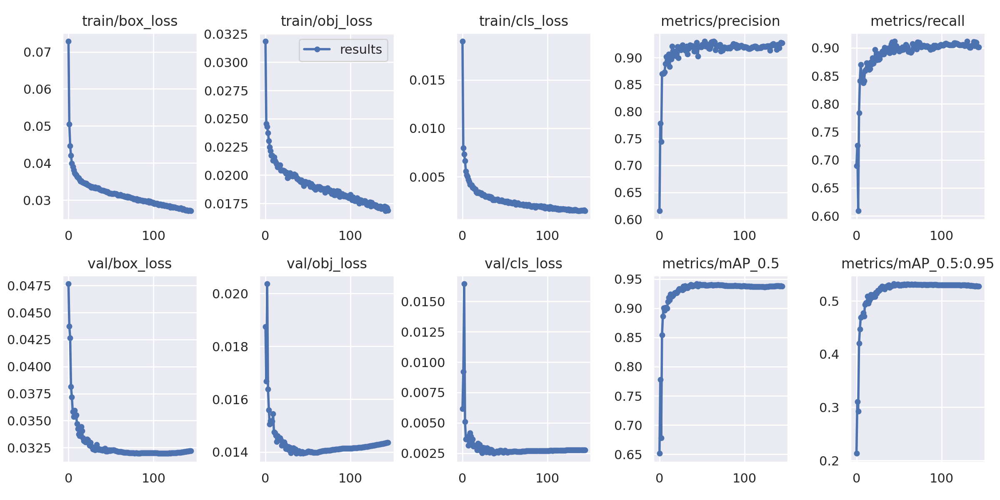

# are you wearing a mask?

State of the art model for detecting masked and unmasked faces. Try out the [demo](https://huggingface.co/spaces/hlydecker/are-you-wearing-a-mask)!


**Figure 1:** An example prediction from a model trained on version 5 of the face masks ensemble dataset. This model was able to produce entertaining predictions like that batman is wearing a mask, however this reveals that the model is perhaps learning the wrong thing. From this example we can see that the model thinks that if the top half of a face an the bottom half are different, there might be a mask. Additional data was added to the dataset, and augmentations were made to produce version 8, which was able to address these pitfalls.

## Setup (WIP)

 Create a conda environment for our project, with Python 3.9.
 
```bash
conda create -n masks python=3.9
conda activate masks
```
Install requirements.

```bash
pip install gradio torch pandas numpy torchvision wandb jupyterlab
```

## Training Data (WIP)

To fine tune the model for this app, I created a dataset by combining a few face mask detection datasets available on Kaggle.

1. [Face Mask Detection](https://www.kaggle.com/datasets/andrewmvd/face-mask-detection): This one has a nice diverse mix of images and people, and three classes: no mask, mask, and mask worn incorrectly. Masks is the by far the most common class, with the most images and instances. Mask worn incorrectly is much less common, and from some testing including this class greatly reduces performance. We can kind of live with some degree of class imbalance, but remember our model tries to find the easiest solution so it will basically learn to ignore a super rare class.
2. 

## Results (WIP)

### Summary

| Dataset | Images | Model | Training Time | mAP 0.5 | mAP 0.5:0.95 | Precision | Recall |
| --- | --- | --- | --- | --- | --- | --- | --- |
| Face Masks v8 | 27,000 | YOLOv5s | 3.5 hrs | 94 | 53 | 93 | 89 |

### Face Masks Detector v2 - trained on face masks v8 dataset

#### Metrics



#### Validation Examples

Validation labels:


Validation predictions:


## Acknowledgements (WIP)

## References (WIP)
